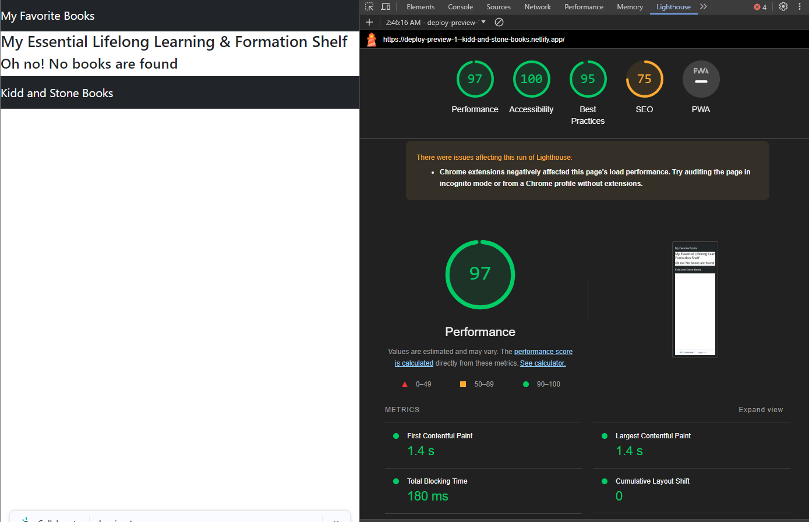

# Project Name

**Author**: Latherio Kidd, Natalie Stone
**Version**: 1.0.0 (increment the patch/fix version number if you make more commits past your first submission)

## Overview

The Can of Books App is a small web application designed to track and catalog impactful books. The app allows users to record books that have influenced them and discover recommendations for future reading. This project involves building a CRUD (Create, Read, Update, Delete) app with MongoDB as the database and connecting it to a React front-end through an Express server.

## Collaboration

### Logistical

**Hours** - The team will work live between the hours of 1pm and 6pm PST. As there is a significant time difference, communication is open to take place between 6am and 12am PST.

**Communication Platform** - Team communication will take place in ***Slack*** and ***Remo***

**Breaks** - To facilitate balance, breaks will be taken as needed by each team member. We agree to work for simultaneously for the first hour of team time, then move to a more flexible schedule. Each member will notify the other when an extended break will take place.

**Timeliness** - Open communication is key to success. If either member begins to fall behind, we'll stop our individual tasks to focus on bringing the overall project back to the timeline. If the reason for falling behind is due to limited understanding, we'll reach out to TA support for additional help.

### Cooperative

**TEAM STRENGTHS**

> - *Latherio* - 
>> - **Development Area**

> - *Natalie* - Project Management, research/queries, frontend layout
>> - **Development Area**: DB creation, importing, routing and rendering

Each member of the team has identified their strengths, as well as areas they wish to grow. Being open and transparent will allow for shared learning and continued development. Each day before working, we will review the previous day and identify at least one area we would like to work on. Additionally, we will offer one area to support the other team member in. 

### Conflict Resolution

Frequent communication, especially in moments where there's nothing wrong, will foster an environment where there is safety in speaking up when things begin to go awry. It is important to identify early the difference between a person who is stronger in one area doing more work versus taking over. This is especially important if the skill is a strength of one team member, and a growth point for the other. If it is noticed that one person is doing significantly more work than the other, we'll begin with a conversation within the team. If no resolution is found, we will elevate the issue to a TA, then to our instructor. In instances of one person asserting too much control or influence, the other teamate will address the concern with the individual directly. If this does not seem safe or doable, either a TA or John will be contacted for mediation. 

As a team we have agreed and validated that we are both enrolled in this program for growth. We have made a committment to facilitate the development of eachother, and not allow the end goal of a working application get in the way of the greater outcome of full understanding.

## Getting Started

To build and run this app locally, follow these steps:

1. Clone the front-end repository (can-of-books-frontend) from [GitHub](https://github.com/AgateHunter/can-of-books-frontend.git).
2. Clone the back-end repository (can-of-books-backend) from [GitHub](https://github.com/LatherioK0818/can-of-books-backend.git).
3. Add all team members as collaborators to both repositories.
4. Review and update the .gitignore files, and add blank .env files to prevent sensitive information from being pushed to GitHub.
5. Deploy both the front-end and back-end to the cloud to check for proof-of-life indicators.
6. Update the README.md files in each repository with documentation regarding the lab and the current state of development.

## Team Agreements(Draft)

**Logistical:**

1. **Availability Hours:**
   - We are generally available [insert specific hours] on weekdays. Weekends can be flexible, but I'll communicate any changes in advance.

2. **Communication Platform:**
   - We'll primarily use Slack and Remo for day-to-day communication. Important matters might be discussed through Slack, Remo, or Phone if emergencies arise.

3. **Break Schedule:**
   - We plan to take short breaks every [insert time interval, e.g., two hours]. Longer breaks will be communicated beforehand. Flexibility is key, and I'm open to adjusting based on team needs.

4. **Falling Behind Plan:**
   - If We start to fall behind, We'll immediately communicate this to the team. We can then collectively assess the situation and, if needed, redistribute tasks or adjust the timeline.

**Cooperative:**

1. **Strengths List:**
   - [Your strengths]
   - [Team member 1's strengths]
   - [Team member 2's strengths]

2. **Utilizing Strengths:**
   - We'll leverage our strengths by assigning tasks that align with individual expertise. Regular check-ins will ensure everyone is contributing optimally.

3. **Areas for Development:**
   - Each of us aims to enhance our skills in [insert specific areas, e.g., coding languages, project management]. We can plan joint learning sessions and share resources.

4. **Day-to-Day Development Approach:**

   - Daily stand-up meetings and code reviews will be integral to ensure shared understanding. Documentation and collaborative problem-solving will be prioritized.

**Conflict Resolution:**

1. **Uneven Workload:**
   - If one person is carrying more weight, we'll openly discuss it in our regular meetings, assess workload distribution, and adjust tasks to ensure a fair share.

2. **Dominant Project Control:**
   - In case someone is dominating, we'll have a candid conversation about collaboration and encourage equal contribution. A rotation of responsibilities might be considered.

3. **Skill Level Disparity:**

   - Recognizing varying skill levels, we'll establish a mentorship system for skill enhancement. Regular knowledge-sharing sessions will be organized to bridge the gap.

## Architecture

The application follows a client-server architecture with the following technologies:

- Front-End: React
- Back-End: Express
- Database: MongoDB with Mongoose
- State Management: React state
- Styling: Bootstrap

The application uses RESTful API routes for CRUD operations and employs React Router for navigation between Home and About pages.

## Trello

[Trello](https://trello.com/b/DUNDdgG0/can-of-books)

## Change Log

- 12-11-2023 7:21pm - Initialized repositories and deployed proof-of-life indicators for front-end and back-end.
- 12-11-2023 7:25pm - Added Mongoose to the server, created Book schema and model, and seeded the database with sample books.
- 12-11-2023 7:35pm - Implemented the /books route to retrieve and display books on the front-end using React.
-

## Estimates

Estimated time for completion: 2 weeks

## Credit and Collaborations

We would like to give credit to the instructional team for providing the lab instructions and the template repositories for the front-end and back-end. Additionally, we appreciate the collaborative efforts of the team members in building this application.

## Light house

